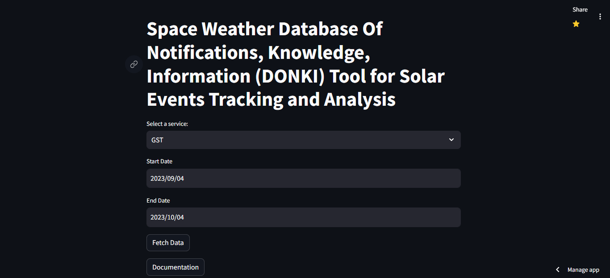
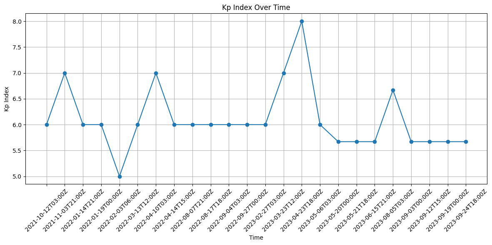
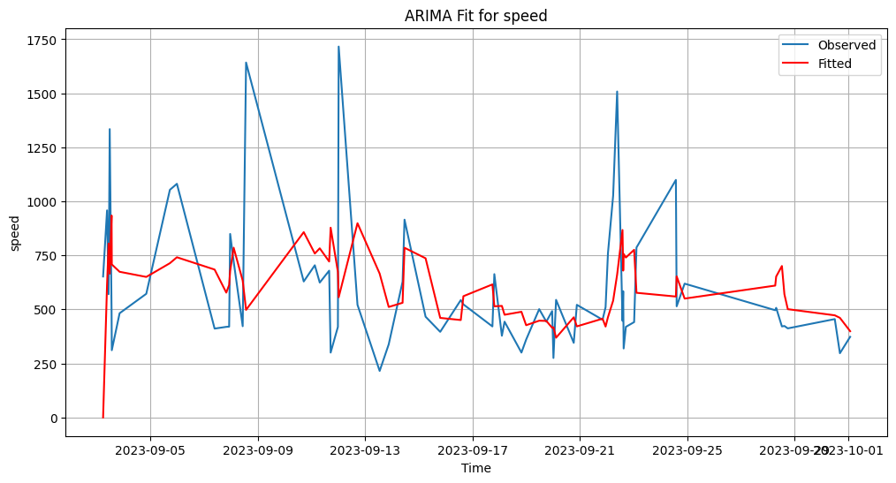
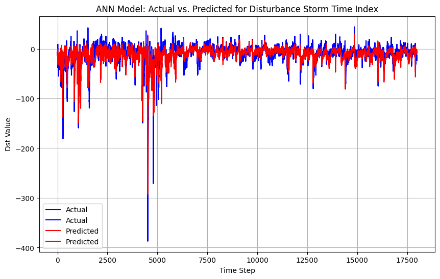
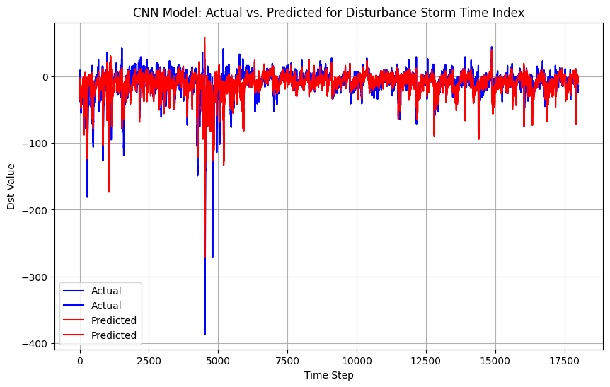
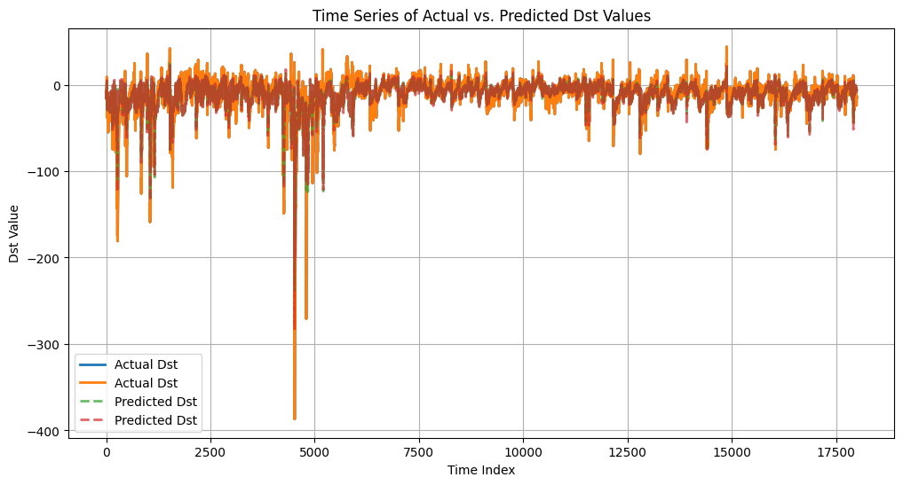
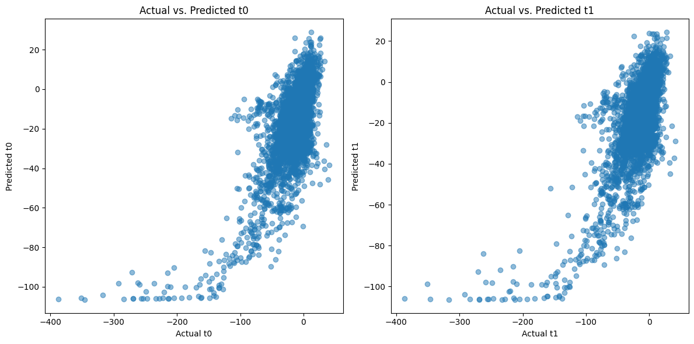

# NASA_Space_App_2023

## **Web based Solar Event Analyzer App using DONKI(Space Weather Database Of Notifications, Knowledge, Information) API**

### Web App UI

This is the UI of the Web App.

### Web App Analyzer Output

This plot showing the Coronal mass ejection Speed over time. The red curve showing the threshold value.

This sowing The Type of Coronal mass ejection (CME) speed typ.

This is Geomagnetic Storm (GST) analyzer . here you can see kp-index.

## ARIMA mathematical Model Prediction

## Artificial Intelligence Model

**ANN**

**CNN**

**RNN**

**LSTM**

### System Architecture

### Reference

[1] NASA APIs

[https://api.nasa.gov/]()

[2] Coronal mass ejection

[https://en.wikipedia.org/wiki/Coronal_mass_ejection](https://en.wikipedia.org/wiki/Coronal_mass_ejection)

[3] DSCOVR - NASA Science

[https://science.nasa.gov/mission/dscovr/](https://science.nasa.gov/mission/dscovr/)

[5] DONKI - Space Weather Database Of Notifications, Knowledge, Information

[https://ccmc.gsfc.nasa.gov/tools/DONKI/]()

[6]  K-index

[https://en.wikipedia.org/wiki/K-index#:~:text=The%20Kp%2Dindex%20is,no%20direct%20effect%20on%20propagation.](https://en.wikipedia.org/wiki/K-index#:~:text=The%20Kp%2Dindex%20is,no%20direct%20effect%20on%20propagation.)

[7] ACE Real-Time Solar Wind - Space Weather Prediction Center

[https://www.swpc.noaa.gov/products/ace-real-time-solar-wind]()

[8] Space Weather Prediction Center

[https://www.swpc.noaa.gov/]()

### API Reference

1.Coronal Mass Ejection (CME)
[https://api.nasa.gov/DONKI/CME?startDate=yyyy-MM-dd&amp;endDate=yyyy-MM-dd&amp;api_key=DEMO_KEY]()

2.Geomagnetic Storm (GST)
[https://api.nasa.gov/DONKI/GST?startDate=yyyy-MM-dd&amp;endDate=yyyy-MM-dd&amp;api_key=DEMO_KEY]()

3.Interplanetary Shock (IPS)
[https://api.nasa.gov/DONKI/IPS?startDate=yyyy-MM-dd&amp;endDate=yyyy-MM-dd&amp;api_key=DEMO_KEY]()

4.Magnetopause Crossing (MPC)
[https://api.nasa.gov/DONKI/MPC?startDate=yyyy-MM-dd&amp;endDate=yyyy-MM-dd&amp;api_key=DEMO_KEY]()

5.Radiation Belt Enhancement (RBE)
[https://api.nasa.gov/DONKI/RBE?startDate=yyyy-MM-dd&amp;endDate=yyyy-MM-dd&amp;api_key=DEMO_KEY]()

6.Solar Flare (FLR)
[https://api.nasa.gov/DONKI/FLR?startDate=yyyy-MM-dd&amp;endDate=yyyy-MM-dd&amp;api_key=DEMO_KEY]()

7.Solar Energetic Particle (SEP)
[https://api.nasa.gov/DONKI/SEP?startDate=yyyy-MM-dd&amp;endDate=yyyy-MM-dd&amp;api_key=DEMO_KEY]()

8.Magnetopause Crossing (MPC)
[https://api.nasa.gov/DONKI/MPC?startDate=yyyy-MM-dd&amp;endDate=yyyy-MM-dd&amp;api_key=DEMO_KEY]()

### Dataset

[1] NASA Open Data Portal

[https://data.nasa.gov/]()

[2]  DSCOVR Space Weather Data Portal

[https://www.ngdc.noaa.gov/dscovr/portal/index.html#/]()

[3] Sunspot Numbers

[https://www.ngdc.noaa.gov/stp/solar/ssndata.html]()
